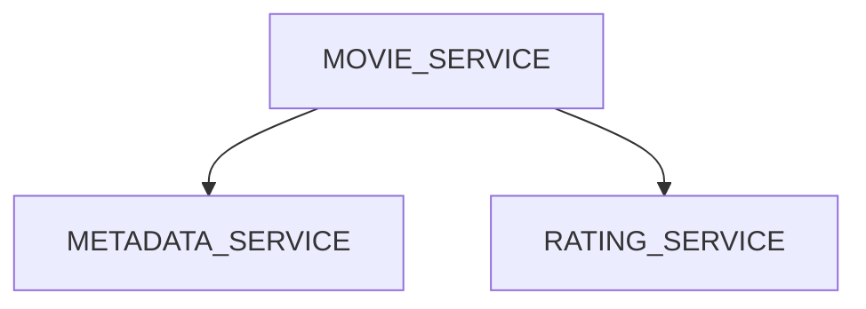

# movie-application

Movie application provides the following features:

- Get the movie metadata(such as title, year, description, and director) and the aggregated movie rating
- Rate a movie

## Movie metadata

- Static dataset

- Fields
  - ID
  - Title
  - Year
  - Description
  - Director
  - List of actors

## API for rating component

- Store the rating record
  - `ID` of the user who gave the rating
  - `type` of the record
  - `ID` of the record
  - `value` Rating value
- Get the aggregated rating for a record by its ID and type

This API supports record types so we can easily add more types of ratings without changing the system. So this component is more generic record rating system. The movie metadata component is now loosely coupled to the rating system - the rating system can store the ratings for movies as well as for any other possible types of records like later we may want to extend the rating functionality to support other types like:

- Rate the actor's performace in some movies
- Rate movie soundtrack etc.

## Splitting the application

The data model for both components are quite different as the movie metadata component stores static data, which is going to be retrieved by ID, while the rating component stores dynamic data, which requires aggregation. Both components seem to be relatively independent of each other. This is a good example of a situation where we may benefit from splitting the application into separate services:

- Logic is loosely coupled
- Data models are different
- Data is generally independent

We can split the application into these microservices:

1. Movie metadata service: Stores and retrieve the movie metadata records by movie IDs
2. Rating service: Store ratings for different types of records and retrieve aggregated ratings for records
3. Movie service: Provides complete information to the callers about a movie or a set of movies, including the movie metadata and its rating.

